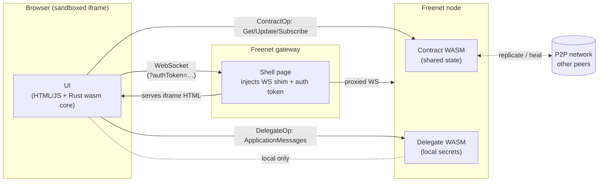
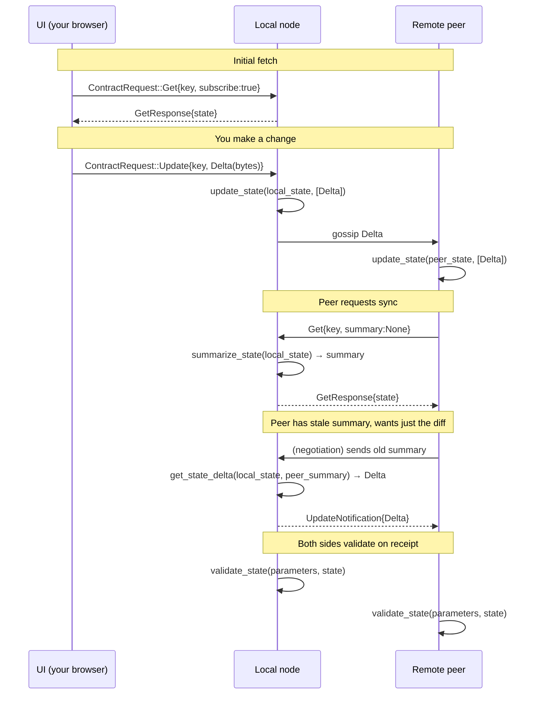
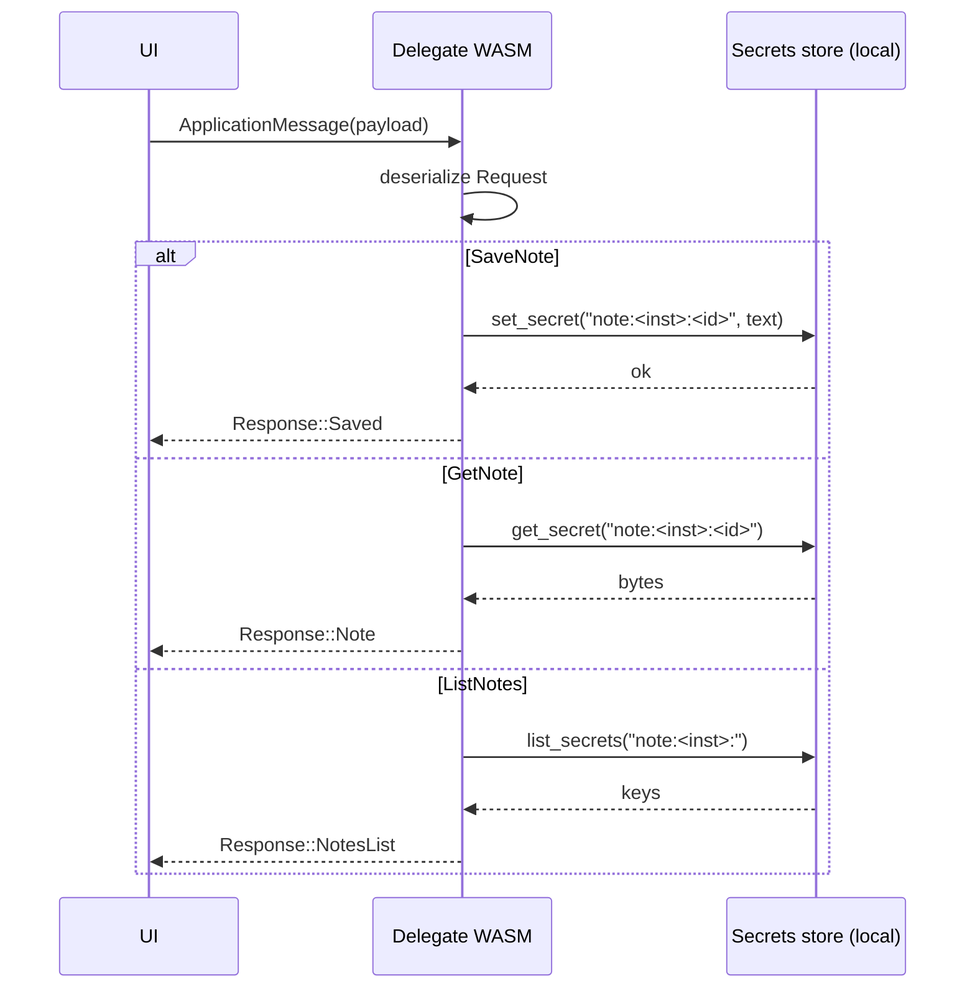
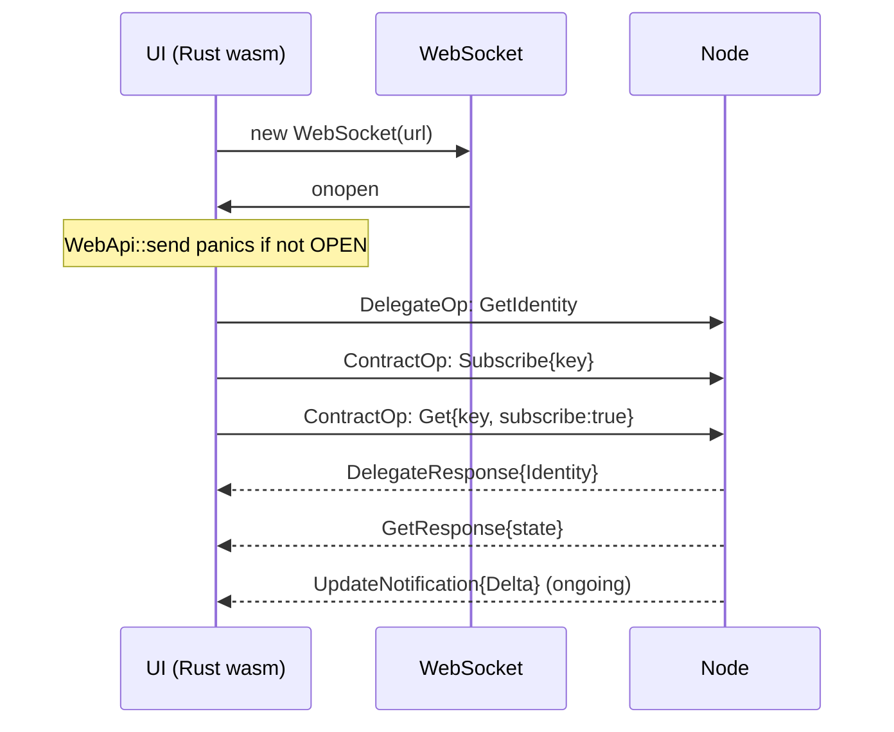
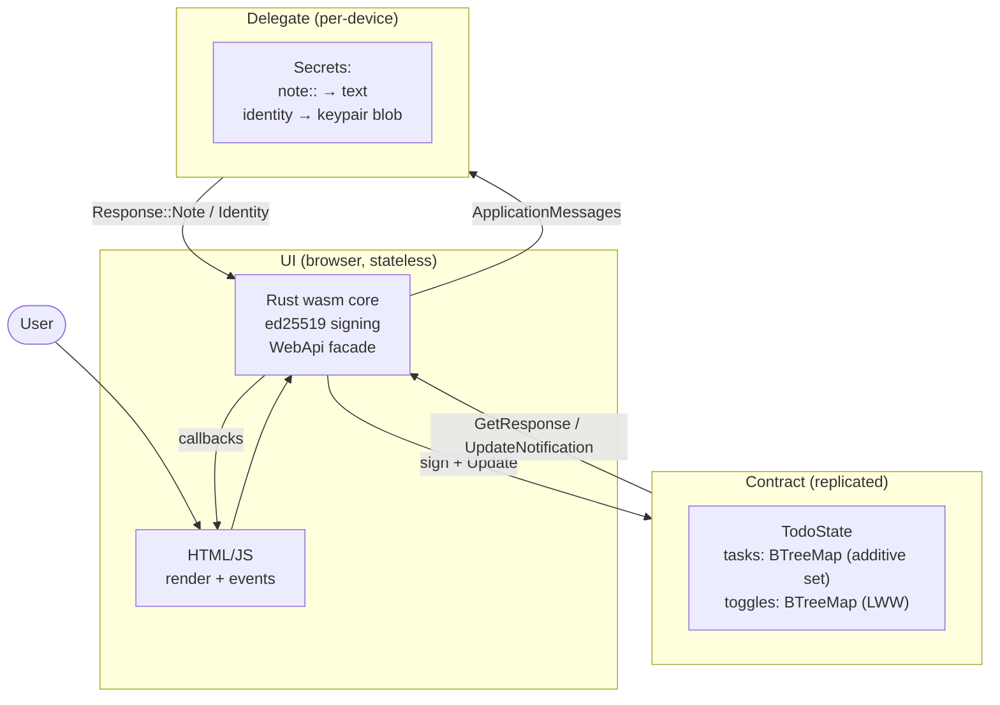

# Tutorial: Reasoning About Freenet dApps

This tutorial walks through the mental model behind a Freenet dApp — how to
decompose an idea into **contracts**, **delegates**, and a **UI**, how the
contract state APIs fit together, and how data actually flows between peers.
It uses `freenet-todo-list` (a shared todo list with private notes) as the running
example. Read this alongside `AGENTS.md` for the low-level API references.

---

## 1. The three building blocks

Every Freenet dApp is composed of exactly three kinds of artifacts. Deciding
which artifact owns which piece of data is the first and most consequential
design decision.

| Artifact | Runs where | State lives | Trust model | Replicated? | Built as |
|---|---|---|---|---|---|
| **Contract** | Every peer that subscribes | The global, shared ledger | Trustless (verify signatures, never trust the peer) | Yes — converges via the monoid merge | WASM |
| **Delegate** | One device (the user's) | Local secrets on that device | Trusted (it's the user's own code on their own machine) | No — per-device | WASM |
| **UI** | The user's browser | None (stateless view + ephemeral caches) | N/A — just renders and dispatches | Served on-demand by the gateway | HTML/JS/WASM |

The single most useful question to ask of any piece of data is:

> **"Does every participant need to see this, or only me?"**

- Everyone → **contract state** (signed, replicated, convergent).
- Only me → **delegate secret** (local, never leaves the device).
- Neither (pure presentation) → **UI-only** (computed at render time, never stored).

`freenet-todo-list` decomposes cleanly along this axis:

- The **todo list itself** (tasks + done/not-done toggles) is shared → contract.
- The **per-task private notes** are personal → delegate secret.
- The **ed25519 signing keypair** (identity) is personal and must survive
  reloads → delegate secret (`identity` key).
- The **rendered list, expanded/collapsed state, input fields** → UI only.

### When to split into multiple contracts

A single contract is one convergence domain — every subscriber reconciles
into the same state via the same merge function. Split into multiple
contracts when:

1. **Different trust/participation sets.** A public chat room and a private
   DM thread have different subscribers; put them in separate contract
   instances (or separate contract *code*).
2. **Different merge semantics.** A CRDT set and a last-writer-wins counter
   don't compose into one monoid cleanly. Two contracts, two merge funcs.
3. **Independent evolution.** Contract code is content-addressed by its WASM
   hash — changing the code changes the key and strands old state. Keeping
   unrelated concerns in separate contracts lets you upgrade one without
   losing the other.

`freenet-todo-list` has **one** contract (the todo list). The notes are *not* a second
contract — they're a delegate secret, because they're not shared at all.

### When to split into multiple delegates

A delegate is a WASM module with its own secrets namespace, keyed by
`DelegateKey` (= `key` ⊕ `code_hash`). Split when:

1. **Different code_HASH upgrade cadences.** Upgrading delegate WASM re-keys
   it and strands stored secrets (see `AGENTS.md` → "Delegate WASM Upgrade").
   Isolate volatile logic from stable secret storage.
2. **Different secret schemas.** Each delegate owns its own `set_secret` /
   `get_secret` namespace; mixing unrelated schemas in one delegate is fine
   but couples them at upgrade time.

`freenet-todo-list` has **one** delegate that owns both notes and identity, because
they share an upgrade cadence and a simple schema. A production version
might split identity into its own delegate so a notes-bug doesn't strand
the user's signing key.

---

## 2. How the components relate



Three things to internalize from this diagram:

1. **The UI never talks to the network directly.** It opens one WebSocket to
   the gateway shell (URL derived from `window.location`, never hardcoded),
   and the shell proxies contract/delegate ops to the node. The shell also
   injects the auth token that scopes the delegate's secret namespace.
2. **Contract state flows peer-to-peer; delegate secrets don't.** A
   `ContractRequest::Update` you send is gossiped to other subscribers and
   reconciled by their contract WASM. A `DelegateRequest::ApplicationMessages`
   is executed locally against your device's secrets and the response comes
   straight back.
3. **The contract code runs on every peer.** When you publish an `Update`,
   each subscribing peer runs *your* `update_state` against *their* local
   state to fold your delta in. That's why state must be a commutative
   monoid — order of arrival is non-deterministic.

---

## 3. The contract state API

`ContractInterface` has exactly four methods. They are not arbitrary — each
plays a specific role in the convergence protocol.



### `validate_state(parameters, state, related) -> ValidateResult`

**Purpose:** bouncer at the door. Called whenever a state arrives from the
network (initial `Get`, or a peer-initiated heal). Returns `Valid` or
`Invalid`; invalid state is rejected and not stored.

In `freenet-todo-list` this re-runs `TodoState::validate`, which checks every
`SignedTask` and `SignedToggle` signature. **Never trust the peer** — a
compromised peer could send forged state. Signatures are the only thing that
makes the contract trustless.

### `update_state(parameters, state, data) -> UpdateModification`

**Purpose:** the merge function. Called with the current local `state` and a
`Vec<UpdateData>` of incoming changes (each is a `Delta`, a `State`, or a
`StateAndDelta`). Returns the new state via `UpdateModification::valid(...)`.

This is the heart of the commutative-monoid requirement. The implementation
must satisfy:

```
merge(merge(s, a), b)  ==  merge(merge(s, b), a)  ==  merge(s, a ∪ b)
```

for any pair of deltas `a`, `b`. If it doesn't, peers will silently diverge
and the network can't heal. `freenet-todo-list`'s `TodoState::merge` satisfies this by:

- `tasks`: additive set union (`entry().or_insert`). Idempotent and order-free.
- `toggles`: last-writer-wins by `(ts, signature)` — a total order that's
  independent of arrival order. The signature tie-break is what makes the
  order *total* (no two distinct toggles compare equal).

Note the contract's `update_state` just deserializes and calls
`TodoState::merge`. The merge logic lives in `common/` so it's testable in
isolation — and it *is* tested for commutativity
(`common/src/lib.rs:142`, `merge_is_commutative`).

### `summarize_state(parameters, state) -> StateSummary`

**Purpose:** produce a compact fingerprint of the state that other peers can
use to decide whether they're in sync.

The summary is what gets gossiped cheaply. If two peers have the same
summary, they're converged. If not, the network invokes `get_state_delta` to
produce a diff.

`freenet-todo-list` cheats here: `summarize_state` returns the full state bytes. This
is correct (same state ⇒ same summary) but inefficient — every gossip round
ships the entire list. River-style compact summaries (a Merkle root, a
version vector, a bloom filter) are the production answer. The trade-off is
**summary size vs. delta computation cost**: the smaller the summary, the
more work `get_state_delta` has to do to reconstruct a diff from it.

> **Critical gotcha** (`freenet/freenet-core#4857`): the summary's bytes
> must be deterministic across peers, or core's byte-level convergence check
> fails and rarely-changing fields silently lag for ~5 min until a heal
> repairs them. **Never put a `HashMap` in a summary** — iteration order is
> nondeterministic. Use `BTreeMap`. `freenet-todo-list` uses `BTreeMap` for both
> `tasks` and `toggles` for exactly this reason.

### `get_state_delta(parameters, state, summary) -> StateDelta`

**Purpose:** given our current `state` and a peer's `summary` (which
describes what they already have), produce a `Delta` that brings them up to
date.

This is the diff function — the inverse of `update_state`. The contract is:

```
update_state(peer_state, [get_state_delta(our_state, summarize(peer_state))])
  == our_state
```

`freenet-todo-list`'s implementation is naive: it deserializes the peer's summary,
merges it into a copy of our state (to subtract what they already have), and
returns the result. A real implementation would compute a minimal diff —
but the naive version is correct as long as `merge` is idempotent, which it
is.

### Why these four and not more

The four-method API is the minimum that supports **eventual convergence
without coordinated consensus**:

- `validate_state` keeps garbage out.
- `update_state` lets peers fold in arbitrary arrivals in any order.
- `summarize_state` + `get_state_delta` lets peers cheaply check sync and
  exchange only the missing bits.

There is no "query" API, no "subscribe to field X", no transaction. The
contract is a pure function over state + deltas; all the interesting logic
lives in *how you shape the state* and *how you write the merge*.

---

## 4. Shaping state for convergence

The contract author's real job is not implementing the four methods — it's
designing a state shape that has a commutative, idempotent merge. Some
patterns:

| Pattern | Merge | Use for | `freenet-todo-list` example |
|---|---|---|---|
| **Add-only set** | union | append-only logs, tasks, members | `tasks: BTreeMap<id, SignedTask>` |
| **LWW register** | higher `(ts, tiebreak)` wins | mutable fields, toggles | `toggles: BTreeMap<id, SignedToggle>` |
| **Counter (CRDT)** | sum | like counts | (not used) |
| **OR-Set** | union + tombset | collections with deletion | (not used) |
| **Full state, merge = overwrite** | replace | tiny single-writer state | the naive `summarize` round-trip |

Three rules that will save you:

1. **Sign every field that a peer could forge.** `author` + `signature` on
   every struct. The contract's `validate_state` is the only thing standing
   between a malicious peer and your UI.
2. **Use a total order for LWW.** `timestamp` alone is not enough — two
   peers can write at the same millisecond. Tie-break on something
   deterministic and globally unique (a signature, a hash, a public key).
   `freenet-todo-list` tie-breaks on `signature.to_bytes()`.
3. **Use `BTreeMap`, never `HashMap`, in anything `summarize` returns.**
   Non-deterministic serialization breaks core's convergence check.

---

## 5. The delegate API

The delegate is much simpler than the contract. It implements
`DelegateInterface::process`, which is a synchronous request handler with
access to a secrets store.



The `DelegateCtx` secrets API (v0.5+, synchronous — no message round-trips):

| Method | Purpose |
|---|---|
| `set_secret(&key, &val)` | write or overwrite |
| `get_secret(&key)` | read (returns `Option<Vec<u8>>`) |
| `has_secret(&key)` | existence check |
| `remove_secret(&key)` | delete |
| `list_secrets(prefix)` | enumerate keys with prefix |

Two design decisions in `freenet-todo-list` worth highlighting:

1. **Namespacing by `MessageOrigin`.** The delegate receives
   `origin: Option<MessageOrigin>` on every call. When `WebApp(instance_id)`,
   the notes are keyed `note:<instance_id>:<task_id>`. This is what gives
   per-app isolation in `hosted-mode = true`: the gateway mints a fresh auth
   token per browser session, and that token maps to a distinct
   `ContractInstanceId` in `MessageOrigin::WebApp`. In local dev
   (`hosted-mode = false`) all connections share one `Local` namespace —
   notes are *not* private between browser tabs on the same machine.

2. **Identity storage.** The ed25519 signing key is a delegate secret under
   the literal key `identity`. The UI asks `GetIdentity` on startup; if the
   delegate returns `None`, the UI generates a fresh keypair and sends
   `SaveIdentity`. This is how identity survives reloads despite the sandbox
   blocking `localStorage` and `document.cookie`.

`DelegateKey` anatomy: `DelegateKey::new(key, CodeHash::new(code))`. The
`key` is **not** the `code_hash` — passing one for the other is a silent
failure (the delegate just never receives your messages). Both come from
`fdev publish delegate` output.

---

## 6. The UI: WebSocket, auth, and the sandbox

The UI runs inside a sandboxed iframe served by the gateway at
`/v1/contract/web/<webapp-key>/`. Three constraints shape the design:

1. **The WebSocket URL must come from `window.location`.** Hardcoding
   `ws://127.0.0.1:7509` works in local dev and breaks the moment you deploy
   to a gateway. `freenet-todo-list` builds the URL from `location.protocol` +
   `location.host` + `/v1/contract/command?encodingProtocol=native`.
2. **The shell injects the auth token.** In hosted mode the shell mints a
   per-user token and appends `?authToken=…` to the WS URL (River and Delta
   do this; in local dev the token is empty and the connection is `Local`).
3. **The sandbox blocks `localStorage`, `document.cookie`, and most sync
   APIs.** Any persistent state *must* go through the delegate. This is why
   `freenet-todo-list` stores the signing key in a delegate secret rather than
   `localStorage`.

### The connection sequence



The ordering matters: `WebApi::send` panics if the socket isn't `OPEN`, so
all initial sends must happen inside the `onopen` callback, not
synchronously after `WebApi::start()`. `freenet-todo-list` does this in
`ui/src/lib.rs:120`.

---

## 7. Putting it together: `freenet-todo-list`'s decomposition



The decomposition principle, restated: **the contract holds what everyone
must agree on, the delegate holds what only the user should see, and the UI
holds nothing.** Every other design choice (signing scheme, summary shape,
delegate namespacing) flows from that one split.

---

## 8. Pitfalls checklist

- `HashMap` in `summarize_state` output → silent convergence lag. Use `BTreeMap`.
- LWW with timestamp only → same-ms writes diverge. Add a deterministic tie-break.
- Forgetting to sign a mutable field → any peer can forge it.
- Passing `code_hash` where `DelegateKey.key` goes → silent failure.
- Hardcoding the WS URL → breaks on any non-localhost gateway.
- Storing identity in `localStorage` → lost on reload (sandbox blocks it).
- Sending `WebApi` requests before `onopen` → panic.
- Using `freenet_stdlib::time::now()` in browser wasm → host fn not available; use `Date.now()`.
- `include_str!` of a key file without `.trim()` → `bs58::decode` rejects the trailing newline.
- Treating `hosted-mode = false` as production → all tabs share one delegate namespace.

---

## 9. Where to go next

- `AGENTS.md` — verified API references for stdlib 0.8.4, the dapp-builder
  skill pointers, and the local freenet-core paths.
- `common/src/lib.rs` — the merge function and its commutativity test. This
  is the single most important file to get right.
- `contracts/todo-contract/src/lib.rs` — the four `ContractInterface`
  methods in their simplest working form.
- `delegates/notes-delegate/src/lib.rs` — `DelegateCtx` secrets API usage.
- `ui/src/lib.rs` — the `#[wasm_bindgen]` facade and the WS connection
  sequence.
- The dapp-builder skill (`https://github.com/freenet/freenet-agent-skills` →
  `skills/dapp-builder/`) — canonical patterns for contract upgrades, state
  migration, and the commutativity proptest recipe.
